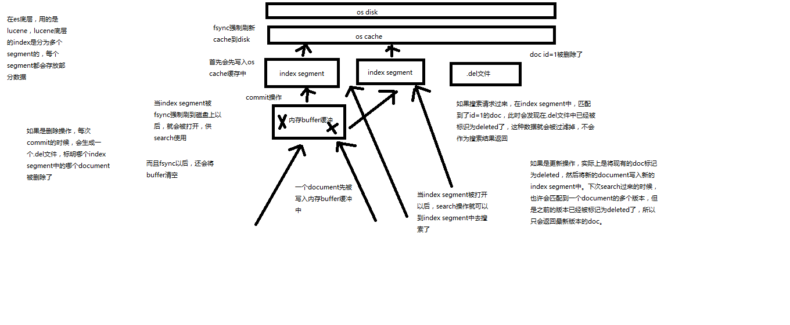
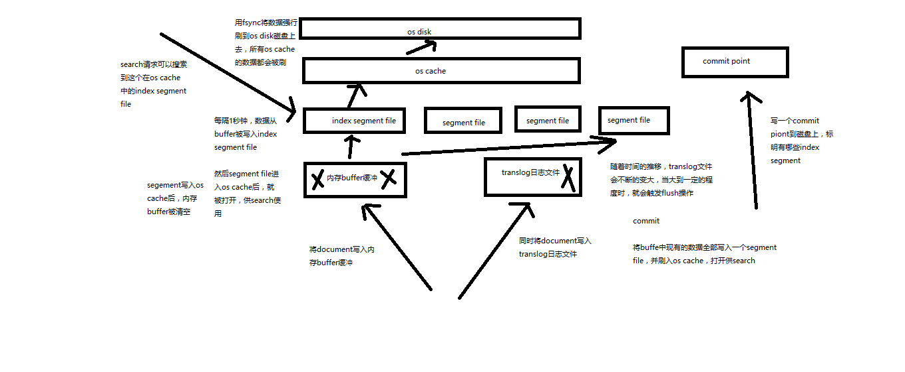

# 一、基本操作原理

## 1、路由原理

1. 每次增删改查一个document的时候，都会带过来一个routing值，默认就是这个document的_id(可能是手动指定也可能是自动生成)

   - 每次把这个routing值先进行hash，产出一个hash值

   - 然后将这个hash值取模，hash / primary shard数量

   - 结果就决定了，document在哪个node上处理

   - es保证，取模计算结果，结果一定是在0~number_of_primary_shards-1之间这个范围内的

     

## 2、es写过程

1. 对于写请求，es会选择一个node发送请求过去，这个node就是协调节点

2. 协调节点对document进行路由，将请求转发给对应的node(有primary shard)

3. 实际上是在primary shard上处理请求，然后将数据在同步到replica node

4. 协调节点，如果发现primary node和所有的replica node都搞定之后，会将结果返回给客户端

   

## 3、es写一致性原理

### 1、每次写(增删改)之前会判断shard活跃情况

- one

- all

- quorum, 所有shard大部分时活跃的

  - (primary + replicas) / 2 + 1，当replicas > 1时才生效

  - 为什么es采用这种机制 当replicas > 1时才生效：

    - 1p1r，quorum=2，若1台服务器，由于相同的shard与realicas不能分配在同一台服务器上，所以此时的shard活跃数是1，写无法进行，es为了避免这种情况的发生

  - 3p,1r 分析：

    - quorum=3 ，理论上：p0r2,p1r0,p2r1

    - 若2服务器

      p0r2,p1r0 ok没问题；p0r2,p2r1 活跃数2，写无法执行

    - 若3台服务器，没问题


## 4、document查询原理

### 1、概述

对于读请求，不一定转发到primary shard 也可以转发到replica shard处理

### 2、过程

1. 客户端发送请求到任意一个node，成为协调节点
2. 协调节点对document进行路由(es保证，写、读的路由结果是一样的)，将请求转发到对应的node，此时会使用随机轮询算法，在primary shard以及其所有replica中随机选择一个，让读请求负载均衡
3. 接收请求的node返回document给协调节点
4. 协调节点返回document给客户端
5. 特殊情况：document如果还在建立索引过程中，可能只有primary shard有，任何一个replica shard都没有，此时可能会导致无法读取到document，但是document完成索引建立之后，primary shard和replica shard就都有了

### 3、分页查询deep paging性能问题：

1. 在分布式场景下，多shard，数据是保存在各个shard中的，读的时候，会路由到各个shard，这个过程当然由协调节点负责，最后收集的数据会发送给客户端。
2. 想象一下，在分页的情况下，es是怎么查询的？
3. 假如有3000条数据，3shard，故每个shard由10000条数据，需求是，查询9990～10000区间的数据。
4. 实际上，es执行中，不可能只查询一个shard的9990-10000(因为数据是分片的)，所以他会获取每一个shard 9990-10000的数据，然后一起返回给协调节点(数据共计10000*3)，协调节点在排序，在选取其中9990-10000区间的数据
5. 综上，会有大量数据的在内存操作，影响性能


## 5、document写入原理

### 1、写入流程(演变1)



```
（1）数据写入buffer
（2）commit point
（3）buffer中的数据写入新的index segment
（4）等待在os cache中的index segment被fsync强制刷到磁盘上
（5）新的index sgement被打开，供search使用
（6）buffer被清空

每次commit point时，会有一个.del文件，标记了哪些segment中的哪些document被标记为deleted了
搜索的时候，会依次查询所有的segment，从旧的到新的，比如被修改过的document，在旧的segment中，会标记为deleted，在新的segment中会有其新的数据
```

### 2、近实时(对1优化-演变2)

从写入到被查询到，只需要1s，


```
写入流程别改进如下：磁盘IO，很耗时
（1）数据写入buffer
（2）每隔一定时间，buffer中的数据被写入segment文件，但是先写入os cache
（3）只要segment写入os cache，那就直接打开供search使用，不立即执行commit

数据写入os cache，并被打开供搜索的过程，叫做refresh，默认是每隔1秒refresh一次。也就是说，每隔一秒就会将buffer中的数据写入一个新的index segment file，先写入os cache中。所以，es是近实时的，数据写入到可以被搜索，默认是1秒。
```

```javascript
//手动刷，没必要，es默认1s刷新buffer到内存一次
POST /my_index/_refresh

//对于实时性要求比较低时，可以适当延长刷新缓存间隔
PUT /my_index
{
  "settings": {
    "refresh_interval": "30s" 
  }
}
```


### 3、最终版本




```
再次优化的写入流程

（1）数据写入buffer缓冲和translog日志文件
（2）每隔一秒钟，buffer中的数据被写入新的segment file，并进入os cache，此时segment被打开并供search使用
（3）buffer被清空
（4）重复1~3，新的segment不断添加，buffer不断被清空，而translog中的数据不断累加
（5）当translog长度达到一定程度的时候，commit操作发生
  （5-1）buffer中的所有数据写入一个新的segment，并写入os cache，打开供使用
  （5-2）buffer被清空
  （5-3）一个commit ponit被写入磁盘，标明了所有的index segment
  （5-4）filesystem cache中的所有index segment file缓存数据，被fsync强行刷到磁盘上
  （5-5）现有的translog被清空，创建一个新的translog

基于translog和commit point，如何进行数据恢复

fsync+清空translog，就是flush，默认每隔30分钟flush一次，或者当translog过大的时候，也会flush

POST /my_index/_flush，一般来说别手动flush，让它自动执行就可以了

translog，每隔5秒被fsync一次到磁盘上。在一次增删改操作之后，当fsync在primary shard和replica shard都成功之后，那次增删改操作才会成功

但是这种在一次增删改时强行fsync translog可能会导致部分操作比较耗时，也可以允许部分数据丢失，设置异步fsync translog

PUT /my_index/_settings
{
    "index.translog.durability": "async",
    "index.translog.sync_interval": "5s"
}
```

### 

### 4、海量磁盘文件合并

 

## 6、type基本原理

### 1、type底层数据结构

1. lucene 建立索引的时候，是没有type概念的，在document中，实际上会把type作为field添加到文档列中的，即_type字段，es通过type查询，实际上是通过 _type值来筛选过滤的

   ```javascript
   {
       "_index" : "mall",
       "_type" : "product",
       "_id" : "5",
       "_score" : 1.0,
       "_source" : {
         "name" : "mall05"
       }
   }
   ```

   

2. 为什么不建议一个索引多type，或者说，多个type带来哪些问题

   - 首先每次查询的元数据会比较大，因为多type，这个控制好的话，对于系统的影响可以控制
   - 由于是多个type，所以每个type的数据结构是不同的，放在同一个in dex下，搜索type会被揉到一起去，那么每条数据会有很多field都是空值，浪费资源，产生性能问题
   - 而且，如果多type，那么每个type的field在这个index下名称是唯一的，总之，想象一下es的存储方式，即可get到点
   - 综上，还是采用一个index一个type的方式较为稳定安全


# 二、应用

## 1、分词器

### 1、内置分词器

```javascript
Set the shape to semi-transparent by calling set_trans(5)

standard analyzer：set, the, shape, to, semi, transparent, by, calling, set_trans, 5（默认的是standard）
simple analyzer：set, the, shape, to, semi, transparent, by, calling, set, trans
whitespace analyzer：Set, the, shape, to, semi-transparent, by, calling, set_trans(5)
language analyzer（特定的语言的分词器，比如说，english，英语分词器）：set, shape, semi, transpar, call, set_tran, 5
```


### 2、测试分词情况

```javascript
GET /_analyze
{
	"analyzer": "standard",
	"text": ""
}
```

### 3、定义分词器

1. standard

   - standard tokenizer: 以单词边界进行切分
   - standard token filter: 什么都不做
   - lowercase token filter: 将所有字母转换为小写
   - stop token filter(默认禁用): 起初停用词

2. 修改索引的分词机制

   ```javascript
   //设置标准的分词器，且 把过滤掉部分英文
   PUT /my_index
   {
     "settings": {
       "analysis": {
         "analyzer": {
           "es_std": {
             "type": "standard",
             "stopwords": "_english_"
           }
         }
       }
     }
   }
   
   //结果: a dog is in
   GET /my_index/_analyze
   {
     "analyzer": "standard",
     "text": "a dog is in"
   }
   
   //结果: dog
   GET /my_index/_analyze
   {
     "analyzer": "es_std",
     "text": "a dog is in"
   }
   ```

   

3. 定制化自己的分词器

   ```
   //定制分词器
   PUT /my_index
   {
     "settings": {
       "analysis": {
         "char_filter": {
           "&_to_and": {
             "type": "mapping",
             "mappings": ["&=>and"]
           }
         },
         "filter": {
           "my_stopwords": {
             "type": "stop",
             "stopwords": ["the", "a"]
           }
         },
         "analyzer": {
           "my_analyzer": {
             "type": "custom",
             "char_filter": ["html_strip", "&_to_and"],
             "tokenizer": "standard",
             "filter": ["lowercase", "my_stopwords"]
           }
         }
       }
     }
   }
   
   //结果: tomandjerry are friend in house haha
   GET /my_index/_analyze
   {
     "text": "tom&jerry are a friend in the house, <a>, HAHA!!",
     "analyzer": "my_analyzer"
   }
   ```

   


## 2、mapping

### 1、查看mapping

```javascript
GET /mall/_mapping
GET /mall/_mapping/test
```

### 2、数据类型

1. 基本类型
   - string、text
   - byte、short、integer、long
   - float、double
   - boolean
   - date
2. 动态解析(put不存在的的索引文档时数据会默认创建mapping)
   - True、false -> boolean
   - 123 -> long
   - 123.456 -> double
   - 2020-01-01 -> date
   - "" -> string/text

### 2、更新mapping 

#### 1、分词影响

1. field 的 type 是 keyword 不会进行分词

   ```javascript
   //添加字段content，类型为keyword
   PUT /mall2/_mapping/test
   {
     "properties": {
       "content": {
         "type": "keyword"
       }
     }
   }
   
   //测试分词
   GET mall2/_analyze
   {
     "field": "content",
     "text": "my dogs"
   }
   
   //结果 my dogs，没有分词
   ```

#### 2、更新

不可以修改、删除已有的字段

解决方案：建立新的索引，重新封装旧的索引数据，再导入到新的索引里

```javascript
//创建
PUT /mall2
{
  "mappings": {
    "test":{
      "properties": {
        "lu_id": {
          "type": "text",
          "index": false
        },
        "title": {
          "type": "text",
          "analyzer": "english"
        },
        "date": {
          "type": "date"
        }
      }
    }
  }
}

//添加新的字段
PUT /mall2/_mapping/test
{
  "properties": {
    "price": {
      "type": "double"
    }
  }
}
```

- index，默认true，当设置false，该字段会被存储，在_source中会显示出该字段，但是不能被查询
- type，keyword 不分词


## 3、DSL查询

#### 1、bool

must、must_not、should、filter

```javascript
GET /mall/product/_search
{
  "query": {
    "bool": {
      "must": [
        {
          "match": {
            "producer": "producer"
          }
        }
      ],
      "should": [
        {
          "match": {
            "name": "special"
          }
        },
        {
          "match": {
            "price": 50
          }
        }
      ],
      "must_not": [
        {
          "match_phrase": {
            "name": "special yagao"
          }
        }
      ]
    }
  }
}
```

#### 2、filter与query

1. 相关度对比解密

   - filter 只是过滤数据，不会计算相关度，不会排序，对相关度没有影响

   - query 会计算每个document对于搜索条件的相关度，并按照相关度排序

   ```javascript
   //query查询，相关度_score=1.0
   GET /mall/product/_search
   {
     "query": {
       "range": {
         "price": {
           "gte": 30
         }
       }
     }
   }
   GET /mall/product/_search
   {
     "query": {
       "constant_score": {
         "filter": {
           "range": {
             "price": {
               "gte": 30
             }
           }
         }
       }
     }
   
   //filter查询过了，相关度_score=0.0
   GET /mall/product/_search
   {
     "query": {
       "bool": {
         "filter": {
           "range": {
             "price": {
               "gte": 30
             }
           }
         }
       }
     }
   }
   ```

   

2. 性能

   - filter不会计算相关度，不会排序，同时还有内置的自动cache最常使用filter的功能
   - query，相反，无法cache结果

#### 3、query搜索语法

1. match_all，查询所有

2. match，field

   ```javascript
   GET /mall/product/_search
   {
     "query": {
       "match": {
         "name": "lu"
       }
     }
   }
   ```

3. multi_match

   ```javascript
   GET /mall/product/_search
   {
     "query": {
       "multi_match": {
         "query": "special",
         "fields": ["name", "producer"]
       }
     }
   }
   ```

4. range query

5. term query，精确匹配，不会分词

6. terms query

#### 4、排序

1. 数值排序

   ```javascript
   GET /mall/product/_search
   {
     "sort": [
       {
         "price": {
           "order": "desc"
         }
       }
     ]
   }
   ```

2. 字符串排序

   为了防止，排序的时候，字符串分词，而造成的排序问题，所以需要对字符串额外存储一个不分词的值，keyword表明该字段不会分词

   ```javascript
   PUT /mall3
   {
      "mappings": {
        "test": {
          "properties": {
           "desc2": {
             "type": "text",
             "fields": {
               "raw":{
                 "type": "keyword"
               }
             },
             "fielddata": true
           }
         }
        }
      }
   }
   
   GET /mall3/test/_search
   {
     "query": {
       "match_all": {}
     },
     "sort": [
       {
         "desc2.raw": {
           "order": "desc"
         }
       }
     ]
   }
   ```

## 4、相关度分析

### 1、相关度评分


1. Term frequency : 搜索文本中各个词条在field文本中出现了多少次，越多，相关度越高

2. Inverse document frequency : 根据搜索请求的词条，查看这个词条在所有的document中，一共出现的次数，出现次数越多，相关度越弱

   ```
   搜索请求: hello world
   
   doc1: hello, today is very good
   doc2: hi world, how are you
   
   index总数据1w，hello出现了1000次，world出现了100次，doc2更相关
   ```

3. Field-length norm : field越长，相关度越弱

   ```
   搜索请求: hello world
   
   doc1: {"title": "hello article", "content": "asdfgh"}
   doc2: {"title": "my article", "content": "asdfgh, world"}
   
   hello、world在doc1、doc2出现的次数一样多，都是一次，但是，title字段比content要短，所以doc1相关度更高
   ```

   

## 5、doc-value

### 1、索引

倒排索引用于搜索，正排索引用来排序分组聚合

```
doc1: {"name": "t01", “age”: 1, "content": "hello you as fdg"}
doc2: {"name": "t02", "age": 2, content": "hello asd s world"}

搜索请求: hello world

倒排索引
				doc1	doc2
hello  	1			1
you
as
fdg
asd 
s
world					1
搜索结果 doc1,doc2，且doc2的相关度评分更高

正排索引
	document 	name		age 	content
	doc1			test01	1			hello you as fdg
	doc2			test02	2			hello asd s world
```


## 6、scroll 滚动搜索

- 看起来像分页，分页是一页一页搜索，返回给用户看的
- scroll主要是用来一批一批检索数据，让系统进行处理的，第一次新建scroll，下一次只需要拿到scroll_id即可，滚动查询了，不需要在写查询条件，他是会在设置的超时时间内有效

```javascript
GET /mall/product/_search?scroll=1m
{
  "query": {
    "match_all": {}
  },
  "sort": [
    {
      "price": {
        "order": "desc"
      }
    }
  ], 
  "size": 2
}

GET /_search/scroll
{
  "scroll": "1m",
  "scroll_id": "上一步返回的_scroll_id值"
}
```


## 7、索引维护

可以对索引的分片副本进行设置，注意，索引一旦创建number_of_shards不能改，number_of_replicas还能改

### 1、创建索引

```javascript
PUT /my_index
{
  "settings": {
    "number_of_shards": 1,
    "number_of_replicas": 0
  },
  "mappings": {
    "my_type": {
      "properties": {
        "field01": {
          "type": "text"
        }
      }
    }
  }
}
```

### 2、修改

```
PUT /my_index/_settings
{
  "number_of_replicas": 1
}
```

### 3、删除

```
DELETE /my_index
```


## 8、应用零停机，重建索引

### 1、为什么要重建索引？

1. 概述：

   ​	因为index一旦建立，已有的field是不能被修改的，可以添加新的field，添加的话，停机后在开发才有意义

2. 为什么index不可变？(一下很多不是很理解)

   1. 倒排索引是适用于进行搜索的

   2. 倒排索引的结构

      ```
      descript		doc1		doc2
      qwe					1				1
      asd					1		
      zxc									1
      ```

      - 包含这个关键词的document list
      - 包含这个关键词的所有的document的数量IDF
      - 这个关键词在每个document中出现的次数IF
      - 这个关键词在这个document中的次序
      - 每个document的长度
      - 包含这个关键词的所有document的平均长度

   3. 倒排索引不可变的好处

      - 不需要锁，提升并发能力，避免锁的问题
      - 数据不变，一只保存在os cache中，只要cache内存足够
      - filter cache一只在内存中，因为数据不变
      - 可以压缩，节省cpu和io开销

   4. 坏处

      - 每次都要重新构建索引

### 2、是什么引起，需要重建索引

1. 业务变化，需要对某些field做一些更新

2. 数据初始化的时候，由于数据问题，倒是索引mapping不对

   - 在index还未建立的时候，希望通过 dynamic mapping来建立索引存储数据的情况(没有预先建立索引的mapping，而是等待，传入的第一条数据，自动解析数据类型建立mapping)。例如，title，预期是text，但是在初始化的时候，传进来了“2020-04-16”，此时title字段类型是date，以后传入普通文本的时候，就会报错，类型不对

     ```javascript
     GET /my_index/my_type/1
     
     GET /my_index/_mapping
     
     //type date
     PUT /my_index/my_type/1
     {
       "title": "2020-04-16"
     }
     
     //报错：类型不匹配
     PUT /my_index/my_type/2
     {
       "title": "dqw"
     }
     ```

### 3、如何解决？实现应用的零停机？

1. 解决思路：

   ​	reindex，重新建立索引，将旧索引的数据查询出来，在导入到新索引中

2. 步骤：

   ​	给每个index起一个别名，java应用查询的时候，使用别名索引，这样就能够临时建立一个新的索引，把旧索引数据导入到新索引中，新索引别名与java应用使用的一致即可

   ​	注意，根据别名索引查询的时候，需关注返回结果_index字段，若这个别名是多个索引的映射，查询结果 _index是不同的，数据是他对应的所有索引的。

   ```javascript
   //先查询旧索引mapping
   GET /my_index/_mapping
   
   //给索引起别名，java应用应该始终使用这个别名查询
   PUT /my_index/_alias/lu_index
   
   //查询别名对应的索引，以此来锁定关系，排错
   GET /lu_index/_alias
   
   //建立新的索引
   PUT /my_index_new
   {
     "mappings": {
       "my_type": {
         "properties": {
           "title": {
             "type": "text"
           }
         }
       }
     }
   }
   
   //查询旧索引的数据，scroll 滚动查询配合bulk，是比较提倡的，既好控制bulk数量过大，也采用了批处理提高执行效率
   GET /my_index/_search?scroll=1m
   {
     "query": {
       "match_all": {}
     },
     "sort": "_doc",
     "size": 1
   }
   
   //封装数据，批量更新到新索引中
   GET /_search/scroll
   {
     "scroll": "1m",
     "scroll_id": "上面返回的_scroll_id"
   }
   POST /_bulk
   {"index": {"_index": "my_index_new", "_type": "my_type", "_id": 1}}
   {"title": "2020-04-16"}
   
   //更新别名，移除旧索引的别名映射，改为新索引的别名
   POST /_aliases
   {
     "actions": [
       {
         "remove": {
           "index": "my_index",
           "alias": "lu_index"
         }
       },
        {
         "add": {
           "index": "my_index_new",
           "alias": "lu_index"
         }
       }
     ]
   }
   ```

   

# 三、问题

## 1、bouncing results

1. 问题描述：

   - 回顾es查询过程：

     ​	客户端随机发送查询请求给一个node，node ha sh，routing之后，打到另一台node，该node就是本次查询的协调节点，协调节点，会根据查询条件，去每个primary shard获取数据(当然，如果开启了replica shard 则每个primary shard与之对应的replica shard 之间会采用轮训算法，来处理请求)，最后由协调节点merge，进一步算分、排序、集合...

   - 问题解释：

     ​	这过程，会出现 bouncing results问题，即，查询结果跳跃，即相同的查询条件，每次查询出来的结果不同

   - 问题原因：

     - 原因一：es每次查询，是按照负载均衡轮训算法，从不同replica shard获取数据的，在高并发实时写入数据的场景下，不能保证同一时刻每一个replica shard数据都是一致的，这个原因官方没有明确指出，单纯是个人理解
     - 原因二：由于es写的时候，对于replica shard同步之间是并行的，每个请求之间是无序的，故很容易产生，timestamp一样，且顺序不同的文档数据，在各个replica shard，当客户端采用timestamp排序时，由于每次请求达到的shard不同(由于轮训算法)，所以每次结果的顺序不同，协调节点merge结果自然也不同

2. 问题解决

   - [参考官方文档](https://www.elastic.co/guide/en/elasticsearch/reference/6.8/search-request-preference.html)

     ​	解决思路，实际上就是，查询的时候，确定分片副本查询即可，所以需要设置preference。但是这样的话，单台服务器节点压力会加重，所以还需要切合业务场景去尝试，靠经验


