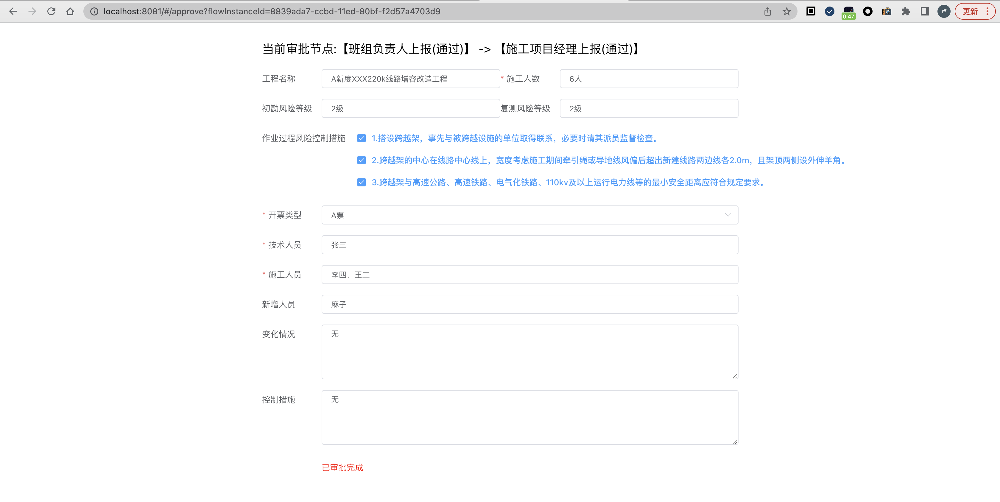

## [快速开始](https://gitee.com/ShowLuu/lu-flow-turbo)

## 作业票开票审批流程

###### 描述：根据开票类型，若是A票无需监理项目部管理员审批；若是B票需要监理项目部管理员审批

### 表单配置

### 流程模型

#### 新建流程

#### 画流程图

###### 保存流程、发布流程

### [发起流程](http://localhost:8081/#/parser?flowDeployId=0cc73bfc-ccaf-11ed-85d5-f2d57a4703d9)

###### 

### 流程审批

#### 开票类型-A票审批

#### 开票类型-B票审批

