[参考](https://cloud.iocoder.cn/bpm/)

## 流程表单

### 如何实现动态的流程表单

- 官网：https://github.com/JakHuang/form-generator
- JSON表单参数对照表：https://github.com/JakHuang/form-generator/issues/46
- 源码copy项目中：components、icons、style、utils、Views
- 可以更改 views bpm form .vue源码，增加字段属性
- 表单的配置 conf
- 表单项的数组 fields

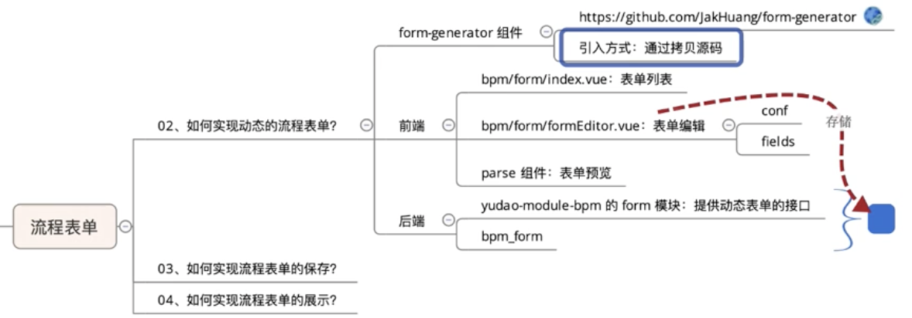

### 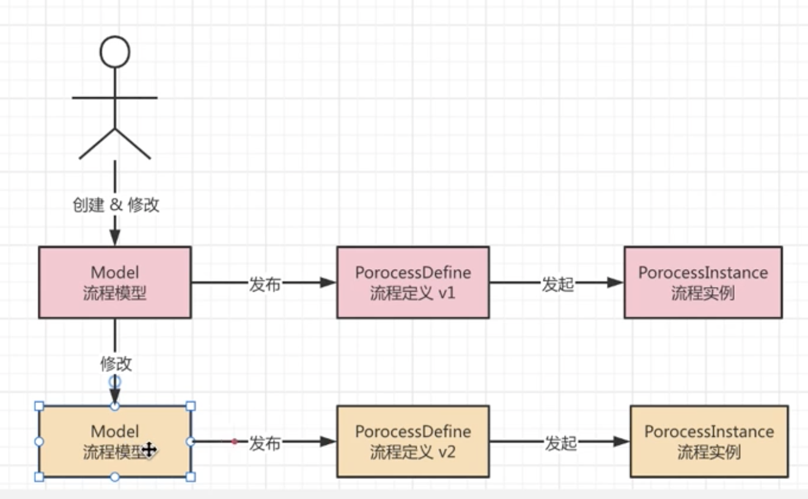

## 流程模型

### 如何实现流程模型的新建

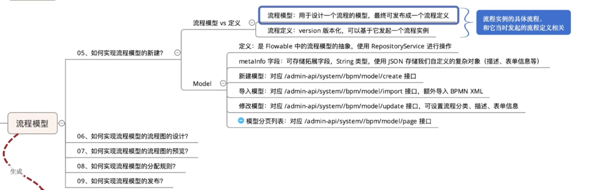

### 如何实现流程模型的流程图设计

- 官网：https://github.com/miyuesc/bpmn-process-designer
- 设计体验：https://miyuesc.github.io/process-designer/
- bpmn.js中文全面进阶文档，可配合代码食用~ vue2：https://github.com/miyuesc/bpmn-process-designer vue3：https://github.com/moon-studio/vite-vue-bpmn-process

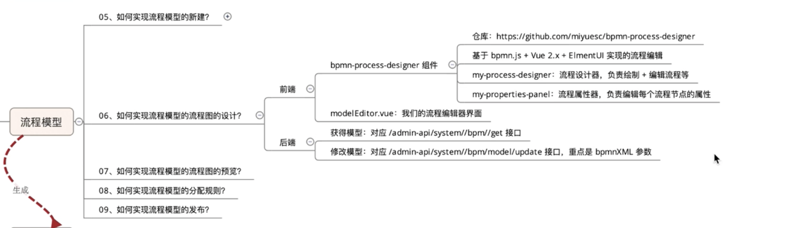

### 如何实现流程模型的分配规则

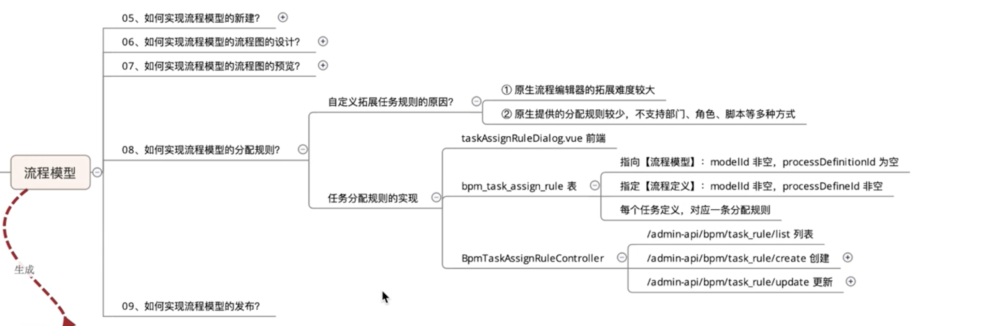

### 如何实现流程模型的发布

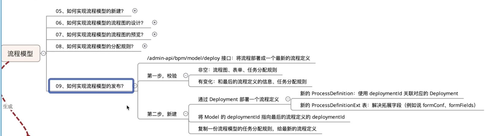

## 流程定义

### 如何实现流程定义的查询

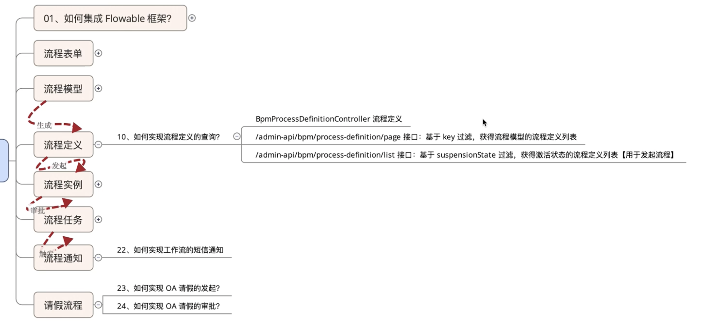

### 如何实现流程的发起

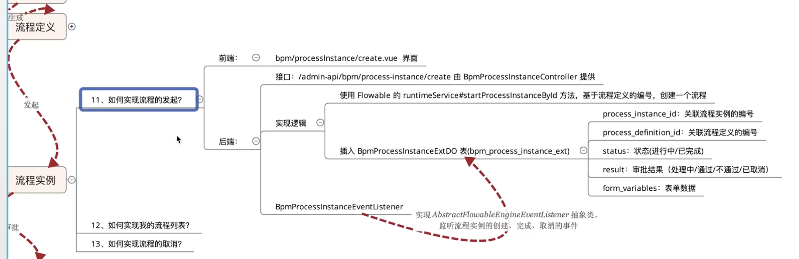

### 如何实现流程的取消

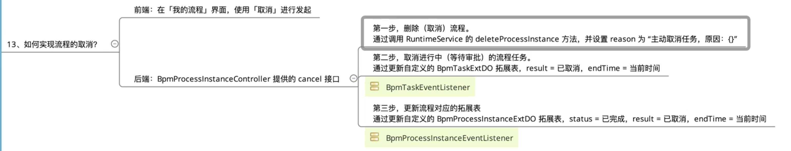

## 流程任务

### 如何实现流程的任务分配

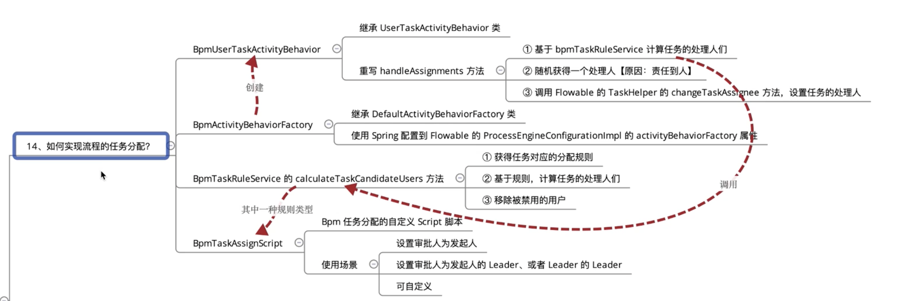

### 如何实现会签、或签任务

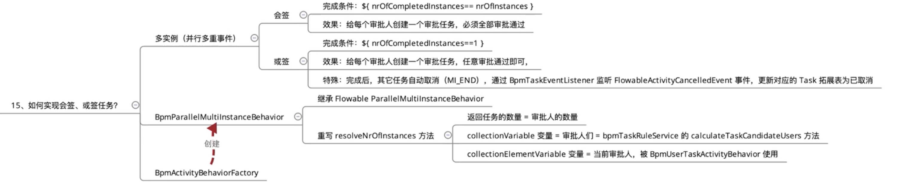

- [会签](https://cloud.iocoder.cn/bpm/#_3-1-%E4%BC%9A%E7%AD%BE)

  - 定义：同一个审批节点设置多个人，如ABC三个人，三人会同时收到审批，会创建3个审批任务，全部统一以后，审批才可到下一个节点
  - 多实例 -> 回路特征 -> 并行多重事件 -> 完成条件 `${ nrOfCompletedInstances== nrOfInstances }`

  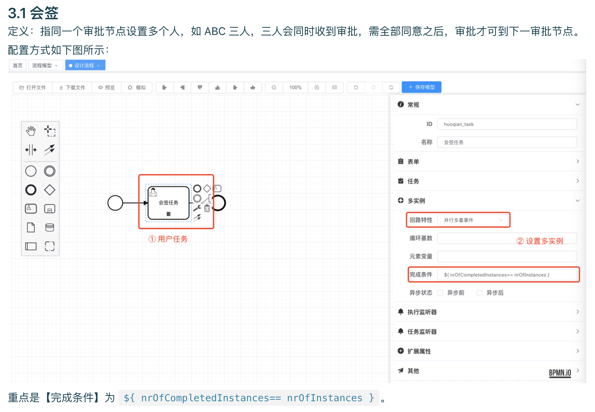

- 或签

  - 定义：同一个审批节点设置多个人，如ABC三个人，三人会同时收到审批，会创建3个审批任务，只要其中任意一人审批即可到下一个节点，其他的自动取消
  - 多实例 -> 回路特征 -> 并行多重事件 -> 完成条件 `${ nrOfCompletedInstances== 1 }`

  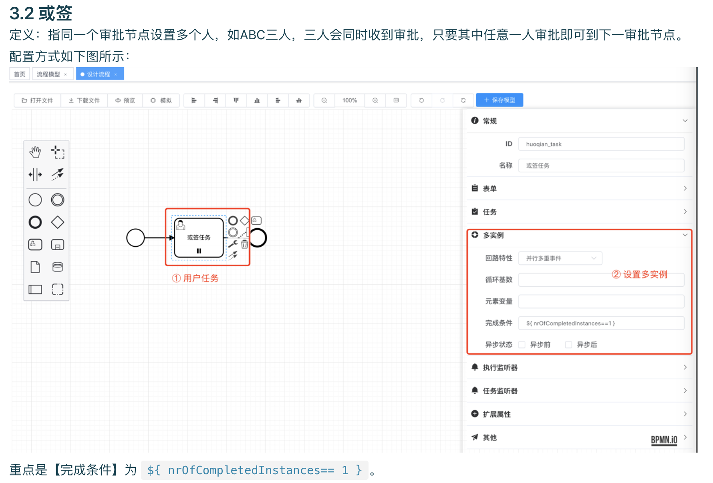

  

### 如何实现待办、已办列表

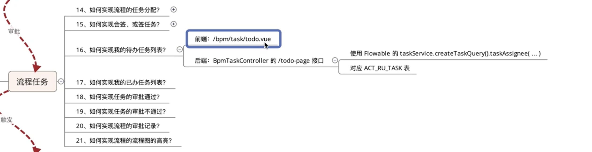

### 如何实现任务的审批通过、不通过

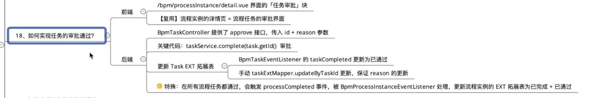

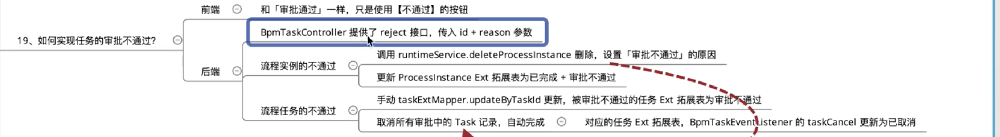

### 如何实现流程的审批记录

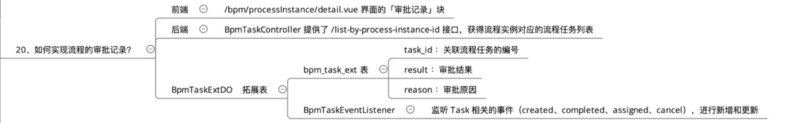

### 如何实现流程的流程图的高亮

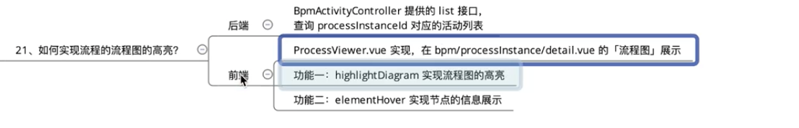

### 如何实现工作流的短信通知

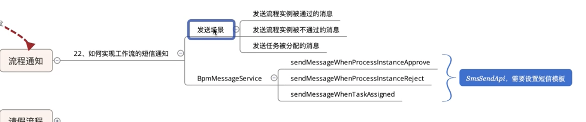

### 如何实现OA请假的发起

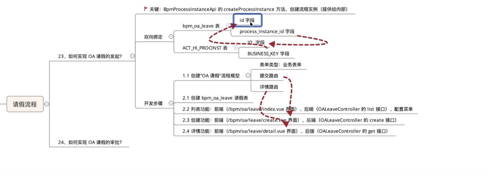

### 如何实现OA请假的审批

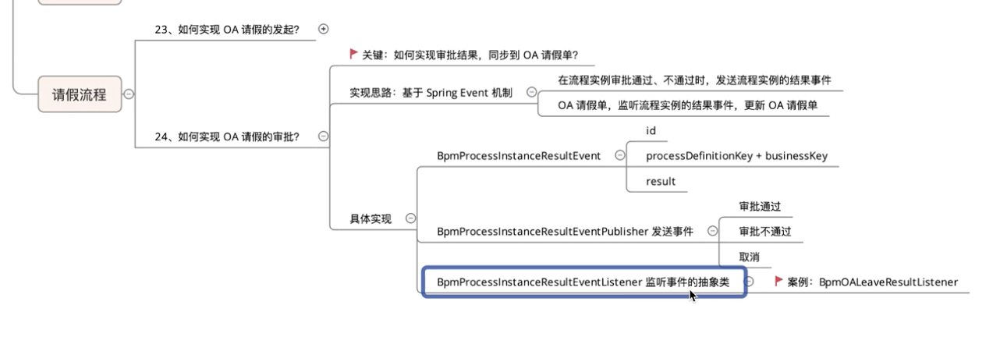

