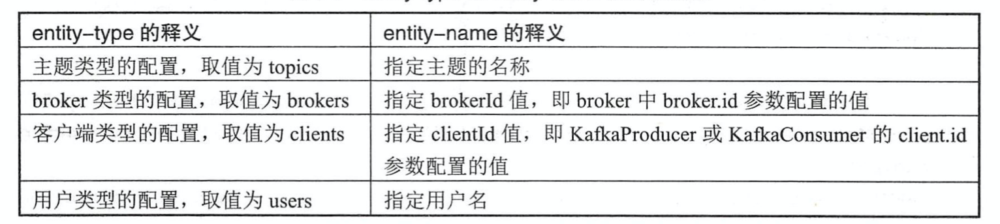

# 一、基本概念

AR=ISR+OSR

AR，所有副本

ISR，与leader保持一定的同步速度的副本

OSR，与leader同步停滞过多的副本

HW，消费者下一次拉取消息的最大offset

LEO(Log End Offset)，消息写入日志的下一次的位置

LSO(LastStableOffset)，生产者提交事务的最后位置。isolation.level，read_uncommitted读到未提交的，此时lso=hw；read_committed读生产者已经提交的

LSO≤HW≤LEO


```shell
后台启动，并将pid记录日志
nohup ./bin/kafka-server-start.sh config/server.properties & echo $! > pid.txt

杀死服务
kill -9 `cat pid.txt`
```


# 二、常见命令

## (一)与主题有关的Kafka-topic.sh脚本

```shell
查看主题
./bin/kafka-topics.sh --zookeeper 127.0.0.1:2181 --list

创建主题(自动分配分区副本)
bin/kafka-topics.sh --zookeeper localhost:2181/kafka --create --topic topic-demo --replication-factor 3 --partitions 4

创建主题(自定义分配分区副本)
./bin/kafka-topics.sh --zookeeper 127.0.0.1:2181 --create --topic lu-learn --replica-assignment 0:1:2,1:2:0,2:0:1

创建主题(带上配置)
./bin/kafka-topics.sh --zookeeper 127.0.0.1:2181 --create --topic lu-learn --replica-assignment 0:1:2,1:2:0,2:0:1 --config max.message.bytes=10000 --config cleanup.policy=compact

展示主题分区副本信息
bin/kafka-topics.sh --zookeeper localhost:2181/kafka --describe --topic topic-demo

找出使用了config额外配置的主题
./bin/kafka-topics.sh --zookeeper 127.0.0.1:2181 --describe --topics-with-overrides

找出所有包含失效副本的分区(ISR<AR，即OSR存在分区)
./bin/kafka-topics.sh --zookeeper 127.0.0.1:2181 --describe --under-replicated-partitions

找出问题的分区
./bin/kafka-topics.sh --zookeeper 127.0.0.1:2181 --describe --unavailable-partitions

删除主题
bin/kafka-topics.sh --zookeeper 127.0.0.1:2181 --delete --topic lu-learn

修改主题(修改分区数，只能增不能减)
./bin/kafka-topics.sh --zookeeper 127.0.0.1:2181 --alter --topic lu-learn --partitions 4

修改主题配置
./bin/kafka-topics.sh --zookeeper 127.0.0.1:2181 --alter --topic lu-learn --config segment.bytes=1048577

删除主题配置
/bin/kafka-topics.sh --zookeeper 127.0.0.1:2181 --alter --topic lu-learn --delete-config segment.bytes

```

## (二)生产消费相关脚本kafka-console-producer.sh 和 kafka-console­ consumer. sh

```shell
消费者订阅主题
bin/kafka.console-consumer.sh --bootstrap-server localhost:9092 --topic topic-demo

生产者生产消息
bin/kafka.console-producer.sh --broker-list losthost:9092 --topic topic-demo
```

## (三)与配置有关的脚本kafka-configs.sh

- 支持两类：变更配置alter、查看配置describe
- 查看配置describe
  - 模版：bin/kafka-configs.sh --zookeeper 127.0.0.1:2181 --describe --entity-type xxx entity-name xxx
    - entity-type：topics、brokers、clients、users
    - 

- 变更配置alter
  - add-config：增改
  - delete-config：删

```shell
./bin/kafka-configs.sh --zookeeper 127.0.0.1:2181 

./bin/kafka-configs.sh --zookeeper 127.0.0.1:2181 --alter --entity-type topics --entity-name lu-learn --add-config max.message.bytes=10001 

./bin/kafka-configs.sh --zookeeper 127.0.0.1:2181 --alter --entity-type topics --entity-name lu-learn --delete-config max.message.bytes
```

## (四)对leader副本进行重平衡的功能kafka-preferred-replics-election.sh

- 再平衡，就是通过zk重新选举，把当前分区的优先副本选举为leader副本.

  - 可以配置broker的再平衡策略，例如是否需要开启再平衡机制，开启再平衡机制，多久检测一次？因为再平衡操作，主要是为了让整个集群负载均衡，且再平衡时，为了保证安全性，所有其他等操作都会暂时停止，对于高并发吞吐的场景，可能会造成丢消息等情况，例如再平衡出发，手动提交偏移量没有执行提交。所以这个策略是情况而定，一般建议手动执行脚本出发。集群负载不均衡也是可用，不用一味的发现需要再平衡的情况就立马执行再平衡，通常也需要一个阈值判断。也需要考虑每个服务器的硬件环境。

- 对所有主题分区进行重平衡：./bin/kafka-preferred-replica-election.sh --zookeeper localhost:2181

- 指定主题分区进行重平衡：./bin/kafka-preferred-replica-election.sh --zookeeper localhost:2181 --path-to-json-file preferred-replica-election-json.txt 

  ```json
  preferred-replica-election-json.txt文件内容
  {
     "partitions":[
         {
             "partition": 0,
             "topic": "lu-learn"
         },
         {
             "partition": 1,
             "topic": "lu-learn"
         },{
             "partition": 2,
             "topic": "lu-learn"
         }
     ] 
  }
  ```

  

## (五)分区重分配kafka-reassign-partitions.sh

- 原理

  - 数据复制：现增加新的副本，然后进行数据同步，最后删除旧的副本。

- 应用场景：

  - 当需要对集群中的某一个节点下线时，为了保证分区及副本的合理分配，可以通过此脚本将该节点上的分区副本迁移到其他的可用节点上。
  - 当集群中新增broker节点时，只有新创建的主题分区才有肯呢个分配到那个新增的节点上，而之前的主题分区则不会自动分配加入到新的节点上，此时就需要分区的冲分配机制了。

- 步骤：

  - 创建一个json文件

    ```json
    {
        "topics": [
            {
                "topic": "lu-test"
            }
        ],
        "version": 1
    }
    ```

  - 根据该json指定所要分配的broker节点列表来生成一份重分配的方案

    - 执行命令：./bin/kafka-reassign-partitions.sh --zookeeper localhost:2181 --generate --topics-to-move-json-file reassign-partitions-json.txt --broker-list 0,2

    - 得到服务器端返回json

      ```json
      Current partition replica assignment
      {"version":1,"partitions":[{"topic":"lu-test","partition":2,"replicas":[0,1],"log_dirs":["any","any"]},{"topic":"lu-test","partition":1,"replicas":[2,0],"log_dirs":["any","any"]},{"topic":"lu-test","partition":3,"replicas":[1,0],"log_dirs":["any","any"]},{"topic":"lu-test","partition":0,"replicas":[1,2],"log_dirs":["any","any"]}]}
      
      Proposed partition reassignment configuration
      {"version":1,"partitions":[{"topic":"lu-test","partition":2,"replicas":[0,2],"log_dirs":["any","any"]},{"topic":"lu-test","partition":1,"replicas":[2,0],"log_dirs":["any","any"]},{"topic":"lu-test","partition":0,"replicas":[0,2],"log_dirs":["any","any"]},{"topic":"lu-test","partition":3,"replicas":[2,0],"log_dirs":["any","any"]}]}
      ```

  - 将上面第二个json保存为文件，执行命令

    - 执行命令：./bin/kafka-reassign-partitions.sh --zookeeper localhost:2181 --execute --reassignment-json-file reassign-partitions-json-execute.txt 
    - 验证命令：./bin/kafka-reassign-partitions.sh --zookeeper localhost:2181 --verify --reassignment-json-file reassign-partitions-json-execute.txt 

- 分区重分配限流

  - 前几个步骤和上面一样
  - 执行命令不同，实际上就多加了一个参数配置：throttle。执行完毕，自动清除设置`Throttle was removed.`
    - ./bin/kafka-reassign-partitions.sh --zookeeper localhost:2181 --execute --reassignment-json-file reassign-partitions-json-execute.txt --throttle 1024

## (六)压测脚本kafka-producer-perf-test.sh、kafka-consumer-perf-test.sh

- 生产者压测脚本kafka-consumer-perf-test.sh

  - ```shell
    执行：./bin/kafka-producer-perf-test.sh --topic lu-learn --num-records 100000 --record-size 1024 --throughput -1 --producer-props bootstrap.servers=localhost:9092 acks=1
    
    响应：10000 records sent, 15649.452269 records/sec (15.28 MB/sec), 205.12 ms avg latency, 321.00 ms max latency, 218 ms 50th, 310 ms 95th, 317 ms 99th, 318 ms 99.9th.
    ```

  - 请求参数：

    - num-records：指定发送消息总数
    - record-size：设置每条消息的字节数
    - producer-props：指定生产者客户端的配置
    - producer.config：指定生产者服务端的配置
    - throughput：吞吐量限流控制`<0`不限流
    - print-mertrics：打印显示更多的指标

  - 响应参数：

    - records sent：发送消息总数
    - records/sec：以每秒发送的消息数来统计吞吐量，括号里面的MB/sec表示以每秒发送消息大小来统计吞吐量
    - avg latency：消息处理的平均耗时
    - max latency：消息处理额最大耗时
    - 218 ms 50th, 310 ms 95th, 317 ms 99th, 318 ms 99.9th：表示50%、95%、99%、99.9%的消息处理耗时

- 消费者压测脚本kafka-consumer-perf-test.sh

  - ```shell
    执行：./bin/kafka-consumer-perf-test.sh --topic lu-learn --messages 1000 --broker-list localhost:9092
    
    响应：start.time, end.time, data.consumed.in.MB, MB.sec, data.consumed.in.nMsg, nMsg.sec, rebalance.time.ms, fetch.time.ms, fetch.MB.sec, fetch.nMsg.sec
    2020-11-15 23:14:05:208, 2020-11-15 23:14:05:389, 0.9766, 5.3954, 1000, 5524.8619, 12, 169, 5.7785, 5917.1598
    ```

  - 响应参数

    - start.time、end.time：起止运行时间
    - data.consumed.in.MB：消费消息的总量，单位MB
    - MB.sec：按字节大小计算的消费吞吐量，单位MB/s
    - data.consumed.in.nMsg：消费的消息总数
    - nMsg.sec：按个数计算的吞吐量
    - rebalance.time.ms：再平衡时间，单位ms
    - fetch.time.ms：拉取消息的持续时间，单位ms
      - fetch.time.ms = end.time - start.time - rebalance.time.ms
    - fetch.MB.sec：每秒拉取消息的字节大小，单位MB/s
    - fetch.nMsg.sec：每秒拉取消息的个数

## (七)kafka-run-class.sh

- 日志

  - 查看

    ```shell
    ./bin/kafka-run-class.sh kafka.tools.DumpLogSegments --files /Users/zhanglu/Desktop/lu/tool/dev/kafka/kafka_colony/kafka_2.11-2.2.0_0/logs/lu-learn-0/00000000000000008464.log 
    
    V0版本，一条MsgSize = 12B(日志消息头部)+14B(日志消体最小)+KeySize+ValueSize
    V1版本，一条MsgSize = 12B(日志消息头部)+22B(日志消体最小)+KeySize+ValueSize
    V2版本，变长字段Varints，更加节省空间，还支持更多额功能，事务、幂等性
    ```

  - 1

## (八)

- ./bin/kafka-dump-log.sh --files /Users/zhanglu/Desktop/lu/tool/dev/kafka/kafka_colony/kafka_2.11-2.2.0_0/logs/lu-learn-0/00000000000000008465.index 

# 三、参数配置

## (一)服务端参数配置

- zookeeper.connect：指明broker要连接的zk集群地址，可以127.0.0.1:2181/kafka
- listeners
  - 指明broker监听客户端连接的地址列表，多个地址逗号隔开，protocoll://hostname:port，协议类型PLAINTEXT、SSL、SASL
  - 不填，有可能会绑定到127.0.0.1这样无法对外提供服务，如果主机名是0.0.0.0，则表示绑定到所有的网卡
  - 绑定私网IP供broker间通信
- advertised.listeners：绑定公网IP供外部客户端使用。
- broker.id：kafka集群中的标识。
- log.dir、log.dirs：配置消息以日志文件的形式持久化到磁盘，配置路径。
- enable.topic.delete：默认值true。可以删除主题。
- auto.create.topics.enable：根据消息自动创建主题，默认值true。
- auto.leader.rebalance.enable：分区自动平衡，默认值true。控制器会启动一个定时任务，轮询所有的broker节点计算每个节点的分区不平衡率(不平衡率=非优先副本的leader个数/分区总数)，是否超过leader.imbalance.per.broker.percentage参数的配置比值，默认值10%，若超过该值则会自动执行优先副本选举，执行周期由参数leader.imbalance.check.interval.seconds控制，默认值300s。
- leader.imbalance.check.interval.seconds：默认值300s。定时周期检查leader是否分布不均衡。
- max.message.bytes：`max.message.bytes`指定broker所能接收消息的最大值，默认值1000012B，约976.6KB
- replica.lag.time.max.ms：follower副本滞后的时间。只要follower每隔一段时间都可以发送FetchRequest给Leader，那个该副本不会被标记为Dead从而从ISR中移入OSR中。
- compression.type：消息压缩类型producer、uncompressed、snappy、lz4、gzip。默认值producer，表示生产者中所使用的原始压缩类型。
- leader.replication.throttled.replicas：用来配置被限制速率的主题所对应的leader副本列表。
- follower.replication.throttled.replicas：用来配置被限制速率的主题所对应的follower副本列表。
- min.insync.replicas：分区ISR集合中至少要有多少个副本。默认值1。
- unclean.leader.election.enable：是否可以从非ISR集合中选举leader副本，默认值false，若true则可能造成数据丢失。
- log.cleanup.policy：`cleanup.policy`日志压缩策略delete、compact。默认delete。
- log.cleaner.delete.retention.ms：`delete.retention.ms`被标识为删除的数据能够保留多久。默认值1天。
- log.segment.delete.delay.ms：`file.delete.delay.ms`清理文件之前可以等待多长时间。默认值1分钟。
- log.flush.interval.message：`flush.message`需要收集多少消息才会将它们强制刷新到磁盘，默认值Long.MAX_VALUE，即让操作系统来决定。
- log.flush.interval.ms：`flush.ms`需要等待多久才会将消息刷新到磁盘，默认值Long.MAX_VALUE，即让操作系统来决定。
- log.index.interval.bytes：`index.interval.bytes`用来控制添加索引项的频率。每超过这个参数设置的消息字节数时就可以添加一个新的索引项，默认值为4096。
- log.message.format.version：`message.format.version`消息格式的版本。
- log.message.timestamp.difference.max.ms：`message.timestamp.difference.max.ms`消息中自带的时间戳与broker收到消息的时间戳之间最大的差值，默认值为Long.MAX_VALUE。当log.messgae.timestamp.type=CreateTime时有效
- log.messgae.timestamp.type：`message.timestamp.type`消息的时间戳类型。默认值CreateTime。logAppendTime。
- log.cleaner.min.cleanable.ratio：`min.cleanable.dirty.ratio`日志清理时的最小污浊率。默认值0.5。
- log.cleaner.min.compaction.lag.ms：`min.compaction.lag.ms`日志在被清理前的最小保留时间，默认值0。
- log.preallocate：`preallocate`在创建日志分段的时候是否要预分配空间，默认值false。
- log.retention.bytes：`retention.bytes`分区中所能保留的消息总量，默认值-1，没有限制。
- log.retention.ms：`retention.ms`使用delete的日志清理策略时，消息能够保留的多长时间，默认值7天。若设置-1，没有期限。
- log.segment.bytes：`segment.bytes`日志分段的最大值。默认值1GB。
- log.index.sizemax.bytes：`segment.index.bytes`日志分段索引的最大值。默认值10MB。
- log.roll.jitter.ms：`segment.jitter.ms`滚动日志分段时，在segment.ms的基础之上增加的随机数，默认值0。
- log.roll.ms：`segment.ms`最长对酒滚动一次日志分段，默认值7天。
- follower.replication.throttled.rate：设置副本的复制的速度。单位B/s。
- leader.replication.throttled.rate：设置leader副本传输的速度。单位B/s。

## (二)、客户端参数配置

### 1.生产者参数配置

- bootstrap.servers
- key. serializer、value.serializer：broker端接收的消息必须以字节(byte[])的形式存在
- client.id：生产者客户端id
- buffer.memory：默认值为32MB。RecordAccumulator缓存的大小。生产者客户端缓存消息的缓冲区大小。
- max.block.ms：默认值60000。由于RecordAccumulator缓存的大小不足，send()客户端发送数据到broker时需要阻塞等待，超时则抛出异常
- batch.size：默认值16KB。byteBuffer复用的缓存，不会频繁对内存的创建和释放，实现缓存的高效利用。当一个ProducerRecord流入RecordAccumulator时，根据分区找到对应的双端队列，若ProducerBatch空则新建，若ProducerBatch内存还够则可以写入，反之新建，新建ProducerBatch时会判断该ProducerRecord的大小是否超过batch.size，若没超过则按照batch.size创建，反之，则以ProducerBatch大小来创建。以batch.size创建的内存快，可以通过BufferPool的管理来进行复用。
- 消息发送数据结构过程：
  - `<分区，Deque<ProducerBatch>>`：ProducerRecord->RecordAccumulator
  - `<Node，List<ProducerBatch>>`：Sender从RecordAccumulator中获取缓存的消息
  - `<Node，Request>`：转换成该格式，Sender线程发送至broker
  - `Map<NodeId，Deque<Request>>`：Sender线程发送至broker前，将请求封装成该格式(InFlightRequests)。作用，缓存已经发出去但还没有收到响应的请求
- max.in.flight.requests.per.connection：默认值5。每个连接最多只能缓存5个未响应的请求。由于重试机制，可能无法保证消息在分区内的顺序性。例如：消息A、消息B，ack != 0，max.in.flight.requests.per.connection大于1，A发完B发，A的时候由于网络抖动发送失败了，触发重试机制，B继续发送且成功了，A重试之后发送成功，BA，消息在分区内的顺序性没有得到保障。当ack等于0，无法知晓消息成功与否，不会触发重试机制。一般建议把max.in.flight.requests.per.connection设置为1，而不是把ack配置为0。max.in.flight.requests.per.connection设置为1，只有A重试成功才会继续执行B。
- leastLoaderNode：负载最小的节点。InFlightRequests数量越少，说明请求响应速度越快，负载越小。用于做元数据请求，消费者组播协议的交互。
- asks：
  - 1：默认值，只保证leader副本成功。一开始leader成功之后返回，当follower同步leader前，leader挂了，follower拉取不到leader最新的数据，就开始选举leader，数据丢失。
  - 0：不等待。消息写入kafka过程中出现异常。
  - -1/all：等待ISR中所有副本都成功写入消息。当ISR中只有一个副本时，当leader挂了，OSR追上之后重新选举为leader后，消息丢失。
- max.request.size：生产者客户端能发送消息的最大值。默认值1MB。
- retries：生产者重试的次数。默认值0。网络抖动、leader选举等，这些异常是可以重试。像消息太大，超过max.reqyest.size，就不会触发重试机制。
- retry.backoff.ms：默认值100。设定两次重试之间的时间间隔。需要预测异常恢复的时间，以便更精准的控制重试机制，避免过早的放弃重试。
- compression.type：消息压缩方式，默认值"none"。`gzip、snappy、lz4`。时间换空间。
- connections.max.idle.ms：多久之后关闭限制的连接，默认值9分钟。
- linger.ms：生产者发送ProducerBatch之前等待更多的消息。默认为0。增大该参数值会增加消息写入的延迟，但可以提升一定的吞吐量。
- receive.buffer.bytes：设置Socket接收消息缓冲区的大小。默认值32KB。-1则使用操作系统的默认值。如果Producer与Kafka处于不同机房，可适当调大该参数。
- send.buffer.bytes：设置Socket发送消息缓冲区的大小。默认值128KB。-1则使用操作系统默认值。
- request.timeout.ms：配置Producer等待请求响应的最长时间，默认值30000ms。不管ack怎么配置，请求服务端之后，等待响应的时间也有个限制。要保证request.timeout.ms大于broker配置的replica.lag.time.max.ms，以防止消息重复提交至服务端的副本上(follower还在同步Leader数据，客户端因为请求超时)。
- partitioner.class：分区器。
- interceptor.class：拦截器。
- enable.idempotence：默认值false。幂等性。
- metadata.max.age.ms：默认值5分钟。元数据更新的最长时间间隔，时间段内，元数据没更新则强制更新。
- transactional.id：默认值null。设置事务id，必须唯一。

### 3.消费者参数配置

- bootstrap.servers
- group.id：配置消费组，默认值""。
- key.deserializer、value.deserializer：kv反序列化器
- client.id：消费者客户端id
- enable.auto.commit：默认值true。自动提交，根据auto.commit.interval.ms周期提交。自动提交的操作在poll方法里面实现。
  - 重复消费情况：消息处理完毕，在提交前消费者挂了，则本次消费位移没有提交，恢复后会重新读这批消息。
  - 消息丢失情况：消息正在处理，还未处理完成前，本次消费位移已经提交，消息处理的挂了(此时业务还没有处理完成)，恢复后不会重新读这批消息。
  - 手动提交依然会产生重复消费的情况：
    - 消费处理逻辑完了，手动提交时，kafka挂了，偏移量没有更新到kafka上，kafka恢复，重复消费
    - 由于新增分区、组内消费者数量变动，触发再平衡时。再平衡期间，消费组变得不可用，若还未来得及提交偏移量就触发再平衡了，当分区重新绑定消费者时，会重复消费。
  - 避免重复消费的解决方案：
    - 手动提交
    - 每处理完一次业务，就把偏移量存入redis，再平衡后(消费者线程开始重新工作前)，监听器的回调方法里面将redis的偏移量设置kafka主题分区，从redis项目关闭前确保先停止消费者线程并把消费位移更新到redis上，项目重启，消费者线程工作前，读取redis偏移量设置kafka主题分区。
- auto.commit.interval.ms：默认值5s，自动提交间隔。
- auto.offset.reset：默认值"latest"。当找不到当前的消费位移或者位移越界时，默认从分区末尾开始消费。“earliest”从头开始消费。"none"不消费，抛异常。
- fetch.min.bytes：配置consumer客户端poll()能从kafka中拉取的最小数据量。默认值1B。
- fetch.max.bytes：配置consumer客户端poll()能从kafka中拉取的最大数据量。默认值50MB。若一条消息大小10B，该值1B，仍然可以正常拉取到消费。
- fetch.max.wait.ms：poll等待时间。默认值500ms。
- max.partition.fetch.bytes：配置从每个分区里返回给consumer的最大数据量。默认值1M。
- max.poll.records：一次poll，最大的消息数量。默认值500条。
- connections.max.idle.ms：指定在多久之后关闭限制的连接，默认值9分钟。
- receive.buffer.bytes：设置Socket接收消息缓冲区的大小。默认值64KB。-1则使用操作系统默认值。
- send.buffer.bytes：设置方式陪Socket发送消息缓冲区的大小，默认值128KB。-1则使用操作系统默认值。
- request.timeout.ms：设置consumer等待请求响应的最长时间。默认值30000ms。
- metadata.max.age.ms：元数据过期时间，默认值5分钟。若在该时间段内未更新则被强制更新。
- reconnect.backoff.ms：配置尝试重新连接指定主机之前的等待时间(退避时间)，默认值50ms。避免频繁连接主机。适用于消费者向broker发送的所有请求。
- retry.backoff.ms：配置尝试重新发送失败的请求到指定主题分区之前的等待时间。避免在某些故障情况下频繁地重复发送。
- isolation.level：配置消费者事务隔离级别。默认值"read_uncommitted"。
  - read_uncommitted：poll将返回所有消息，甚至是已中止的事务性消息，可以读到HW。
  - read_committed：poll将仅返回已提交的事务性消息。最多只能返回LSO(稳定偏移量，已经提交的偏移量)的消息，比未提交的偏移量小1。
- session.timeout.ms：默认值10000ms。组管理协议中用来检测消费者是否失效的超时时间。
- heartbeat.interval.ms：默认值3000ms。当时用分组管理功能时，心跳到消费者协调器之间的预计时间。该值必须比session.timeout.ms小，通常不高于1/3。已控制正常再平衡的预期时间。
- max.poll.interval.ms：默认值300000ms。当通过消费组管理消费者时，该配置指定拉取消息线程最长空闲时间，若超过这个时间间隔还没有发起poll操作，则消费组认为消费者已经离开，将进行再平衡操作。
- partition.aggignment.strategy：分区分配策略。
- interceptor.class：拦截器。

9 10a 11b 12c 13d 14e 15f


