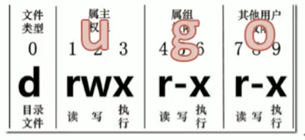

### 目录结构

- /bin：存放经常使用的命令

- /sbin：`s->super user`，存放系统管理员使用的系统管理程序

- /home：存放普通用户的主目录，在Linux中每个用户都有自己的目录，一般该目录以用户的账号命名

- /root：该目录为系统管理员，也是超级权限着的用户主目录

- /lib：系统开机所需要最基本的动态链接共享库，类似于windows里的dll文件，几乎所有应用程序都需要用这些共享库

- /lost+found：一般是空的，当系统非法关机后，这里会存放一些文件

- /etc：存放所有的系统管理所需要的配置文件和子目录

- /usr：存放用户应用程序和文件

- /boot：存放启动linux时使用的一些核心文件，包括，一些连接文件、镜像文件，自己安装的不要放这里

- /proc：虚拟的目录，死系统内存的映射，可以直接访问这个目录

- /srv：service缩写，存放一些服务启动之后需要提取的数据

- /sys：该目录安装了2.6内核中新出现的一个文件系统sysfs

- /tmp：存放一些临时文件

- /dev：类似于windows的设备管理器，把所有的硬件用文件的形式存储

- /media：linux系统会自动识别一些设备，例如U盘、光驱等等，当识别以后，linux会把识别的设备挂载到这个目录下

- /mnt：让用户临时挂载别的文件系统，可以将外部的存储挂载在/mnt/上，然后进入该目录就可以查看里面的内容了

- /opt：给主机额外安装软件所摆放的目录。比如安装一个mysql数据库

- /var：存放着不断扩充的东西，一般将经常被修改的文件放在该目录，例如，各种日志文件

- /selinux：一种安全子系统，能控制程序只能访问特定文件

  

### 用户

- 创建：useradd lu
  - 创建用户li并加入到lu组：useradd -g lu li
  - -c comment 指定一段注释性描述。
  - -d 目录 指定用户主目录，如果此目录不存在，则同时使用-m选项，可以创建主目录。
  - -g 用户组 指定用户所属的用户组。
  - -G 用户组，用户组 指定用户所属的附加组。
  - -s Shell文件 指定用户的登录Shell。
  - -u 用户号 指定用户的用户号，如果同时有-o选项，则可以重复使用其他用户的标识号
- 修改指定用户密码：passwd lu 
- 查看
  - 查看用户1：id lu
  - 查看用户2：cat /etc/passwd
  - 查看加密密码：cat /etc/shadow 
    - 登录名:加密口令:最后一次修改时间:最小时间间隔:最大时间间隔:警告时间:不活动时间:失效时间:标志
  - 查看用户组：cat /ect/group
- 查看当前用户：who | whoami | who am i
- 切换用户：
- 删除用户：userdel -r lu(-r递归删除)
- 修改用户：usermod 选项 用户名

### 用户组

- 创建：groupadd 选项 用户组

  - -g GID 指定新用户组的组标识号（GID）。
  - -o 一般与-g选项同时使用，表示新用户组的GID可以与系统已有用户组的GID相同

- 删除：groupdel 用户组

- 修改：groupmod 选项 用户组

  - -g GID 为用户组指定新的组标识号。

  - -o 与-g选项同时使用，用户组的新GID可以与系统已有用户组的GID相同。

  - -n新用户组 将用户组的名字改为新名字

    #### 实例1：

    ```
    # groupmod -g 102 group2
    ```

    此命令将组group2的组标识号修改为102。

    #### 实例2：

    ```
    # groupmod –g 10000 -n group3 group2
    ```

    此命令将组group2的标识号改为10000，组名修改为group3。

---

### 日期

- 查看时间：date 
  - 格式化查看：
    - date +%Y-%m-%d 
    - date +%F
  - 查看日历：
    - **cal**

---

### vi&vim

- 显示行号：set nu
- 取消显示：set nonu
- 撤销：u
- 删除：
  - 删除其他：
    - 删除词：dw
  - 删除行
    - 删除鼠标当前：d d
    - 删除指定行：1 d
    - 删除范围行：1,10 d
    - 删除指定行至末尾：3, $d
- 复制：
  - 复制词：yw
  - 复制行：yy
- 粘贴：p
- 光标移动到
  - 行头：shift ^
  - 行尾：shift $
  - 页头：1 shift g
  - 页尾：shift g
  - 指定行：3 shift g
- 文本内容操作：
  - 插入：
    - 光标当前位置：i
    - 光标下一位置：a
    - 另起一行：o
  - 替换：%s/java/lu
  - 搜索：/java 
    - 下一个：n
    - 上一个：shift n

#### 1、一般模式

###### 可以：复制、粘贴、删除、阅读

| 语法      | 功能描述                          |
| --------- | --------------------------------- |
| set nu    | 显示行号                          |
| yy        | 复制光标当前一行                  |
| y数字y    | 复制一段(从第几行到第几行)        |
| p         | 箭头移动到目的行粘贴              |
| u         | 撤销上一步                        |
| dd        | 删除光标当前行                    |
| d数字d    | 删除光标(含)后多少行              |
| x         | 删除一个字母，相当于del，向后删除 |
| X         | 删除一个字母，向前删              |
| yw        | 复制一个词                        |
| dw        | 删除一个词                        |
| shift+^   | 移动到行头                        |
| shift+$   | 移动到行尾                        |
| gg或者1+G | 移动到页头                        |
| G         | 移动到页尾                        |
| 数字+G    | 移动到目标行                      |


#### 2、编辑模式

###### 可以编辑内容

1. 进入编辑模式

2. | 按键 | 功能                     |
   | ---- | ------------------------ |
   | i    | 当前光标前               |
   | I    | 光标所在行最前           |
   | a    | 当前光标后               |
   | A    | 光标所在行最后           |
   | o    | 换行，当前光标行的下一行 |
   | O    | 换行，当前光标行的上一行 |

   退出编辑模式，进入一般模式

   按下【Esc】键

   

#### 3、指令模式

###### 可以搜索资料，读取、存盘、大量取代字符、离开vi、显示行号等动作

1. 进入指令模式，在一般模式中，输入【:/?】3个中任何一个按钮.

2. 退出指令模式，删除键

3. 基本语法

   | 命令         | 功能                                           |
   | ------------ | ---------------------------------------------- |
   | :w           | 保存                                           |
   | :q           | 退出                                           |
   | :!           | 强制执行                                       |
   | / 要查找的词 | n查找下一个，N往上查找                         |
   | ? 要查找的词 | n查找上一个，N往下查找                         |
   | :set nu      | 显示行号                                       |
   | :set nonu    | 关闭行号                                       |
   | ZZ(shift+zz) | 没有修改文件直接退出，如果修改了文件保存后退出 |
   | nohl         | 取消高亮                                       |


---

### 查看

- ###### 文件类型与权限-链接数-文件属主-文件属组-文件大小(单位byte)-建立或最近修改的时间-文件名 

  ugo，例子：chmod g+w,o+w 文件目录

  

  - `ls -a`：全部的文件，联通隐藏档(开头为`.`的文件)一起列出来
  - `ls -l`｜`ll`：长数据串列出，包含文件的属性与权限等等数据
  - `ls -al`：查看当前目录的所有内容信息

---

### 目录

- 创建新目录：mkdir 
  - 普通创建：mkdir a
  - 级联创建：mkdir -p a/b/c
- 删除空目录：rmdir

---

### 文件

- 简单查看cat
  - 可列出一些特殊字符而不是空白：cat -A 
  - 列出行号，空白行不标行号：cat -b
  - 列出行号，空白也有行号：cat -n
  - 将结尾的断行字段$显示出来：cat -E
  - 将tab键以^|显示出来：cat -T
  - 列出一些看不出来的特殊字符：cat -v
- 翻页查看more
- 多功能查看less
  - 空白键：向下翻动一页
  - /字符串：搜索
  - 向下查找：n
  - 向上查找：N
  - 离开less：q
- 只看头几行：head -10 1.txt
- 只看尾巴几行：tail -10 1.txt
- 所敲命令历史：history
- 重定向命令：
  - 将所敲命令历史下入文件中，以便查看：history > 1.txt
  - 将列表内容写入文件中：ls -l > 2.txt
  - 将列表内容追加到文件中：ls -al >> 3.txt

---

### 分区

- 磁盘分区查看：fdisk -l
- 分区目录挂载：df /boot
- 分区磁盘空间：df -h

---

### 搜索查找

- find：文件搜索
  
  | 选项            | 功能                       | 例子                    |
  | --------------- | -------------------------- | ----------------------- |
  | -name<查询方式> | 按照指定的文件名查找文件   | find 目录 -name '*.log' |
  | -user<用户名>   | 查找属于指定用户名所有文件 | find 目录 -user root    |
  | -size<文件大小> | 按照指定的文件大小查找文件 |                         |
  
  - 在目录下 根据名字 搜索词：find /lu -name '*.log'
  
- grep：在文件内容搜索字符串匹配的行并输出 grep+选项+查找内容+文件
  
  ###### `|`表示将前一个命令的处理结果输出传递给后面的命令处理
  
  ###### 	例如：ll | grep -n dev
  
  - 只输出匹配行的计数：grep -c 内容 文件
  - 不区分大小写：grep -l 内容 文件
  - 显示匹配行及行号：grep -n 内容 文件
  - 不显示不存在或无匹配文本的错误信息：grep -s 内容 文件
  - 显示不包含皮皮额文本的所有行：grep -v 内容 文件
  
- ls：ls -d auth -l

- which 查找命令在那个目录下

---

### 进程线程 

- ps -aux，可以 ｜grep 查找指定的进程
  - 显示当前终端的所有进程信息：ps -a
  - 以用户的格式显示进程信息：ps -u
  - 显示后台进程运行的参数：ps -x
- ps -ef，以全格式显示当前所有进程
  - 显示所有进程：ps -e
  - 全格式：ps -f
- 显示网络统计信息：netstat，此命令用来显示整个系统目前网络情况
  - 按一定顺序排列输出：an
  - 表示显示哪个进程在调用：p

---

### 压缩与解压

- gzip：只能压缩文件，不能压缩目录；不保留原来的文件 .gz
  - 压缩：gzip 文件
  - 解压：gunzip 文件
- tar：打包目录，压缩为.tar.gz
  - 参数：
    - 产生.tar打包文件：-c
    - 显示详细信息：-v
    - 指定压缩后的文件名：-f
    - 打包同时压缩：-z
    - 解压.tar：-x
  - 压缩：tar -zcvf xxx.tar.gz 1.txt
  - 解压：tar -zxvf xxx.tar.gz
- zip：压缩文件和目录，window/linux通用，zip+参数+xxx.zip+文件
  - 压缩目录：-f 
  - 压缩：zip xxx.zip 1.txt
  - 解压：unzip xxx.zip

---

### 系统监控命令

- top

---

### 文件目录权限

- 解读ls -l：类型与权限 链接数 属主 属组 大小 建立或最近修改的时间 名字
- 文件：r-查看；w-修改；x-执行文件
- 目录：r-列出目录内容；w-在目录中创建和删除；x-进入目录
- 更改文件目录权限：chmod 操作 文件目录，操作可以二进制方式计算
  - 默认目录权限：chmod 755 auth
  - 删除文件需要有写权限
- 改变所属组：chgrp 组名 文件目录
  - auth文件目录所属组改为lu：chgrp lu auth
- 改变所属用户：chown 用户名 文件目录
  - auth文件目录所属用户改为lu：chown lu auth
  - auth文件目录所属组所属用户一起更改：chown root:root auth
- 目录&文件默认规则：
  - 查看阙值：umask 
  - 目录：777 - 022 = 755
  - 文件：666 - 022 = 644

---

### RPM

- 查询
  - 查询锁安装的rpm软件包：rpm -qa | grep、more
  - 查询软件包是否安装：rpm -q 软件包名
  - 查询软件包信息：rpm -qi 软件包名
  - 查询软件包中的文件：rpm -ql 软件包名
- 安装：rpm -ivh rpm包全路径名称
  - i = install，安装
  - v = verbose，提示，即有提示信息
  - h = hash，进度条
- 卸载：rpm -e rpm软件包 或者 rpm -e --nodeps 软件包

---

### 查看系统信息

- 查看环境变量：evn
- ls -l /bin/* sh *
